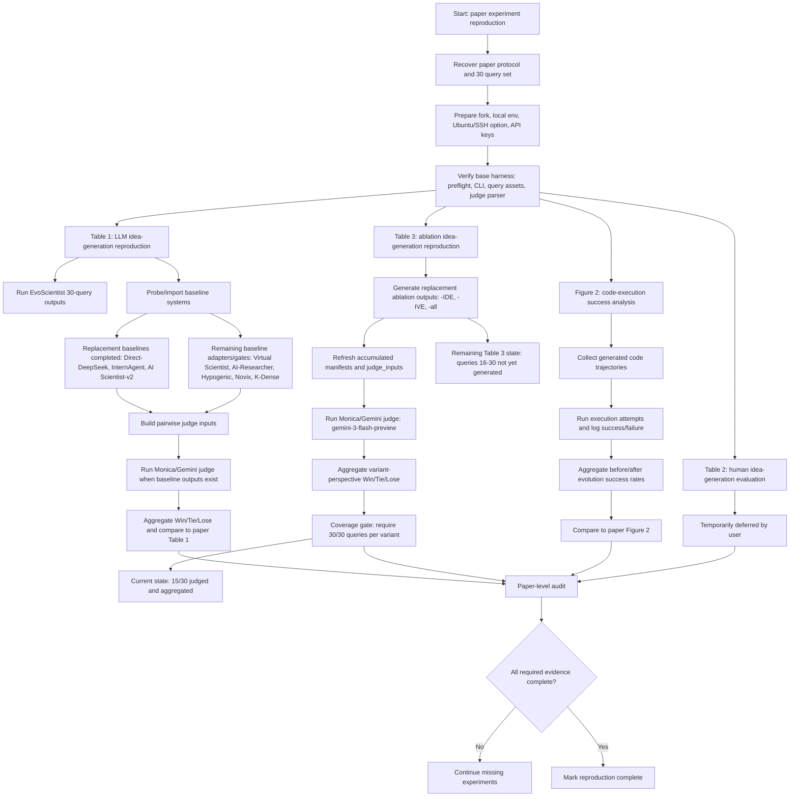

# EvoScientist Experiment Reproduction Flow and Time Estimate

Date: 2026-06-04

This file is an editable experiment-flow sketch. The diagram is Mermaid text, so it can be edited directly in Markdown-aware editors, Mermaid Live Editor, GitHub, or many note tools.

## Editable Flowchart

## Current Status Snapshot

| Component | Current Evidence | Status |
| --- | --- | --- |
| Base harness | `run_preflight.sh` passes 142 tests | Working |
| Table 3 ablation | Queries 01-15 for `-IDE`, `-IVE`, `-all`; Monica/Gemini judge outputs present | 15/30 |
| Table 3 remaining | Queries 16-30 for all three variants | Not yet generated |
| Table 1 | Several replacement baselines and gates exist, but paper-level 7-baseline judge table is not complete | Incomplete |
| Table 2 | User asked to ignore human judge for now | Deferred |
| Figure 2 | Aggregator exists, but full code-execution trajectory evidence is incomplete | Incomplete |

## Time Estimate

Measured latest output-generation batch: queries 11-15, three variants, 15 agent calls.

| Metric | Value |
| --- | ---: |
| Total generation calls | 15 |
| Total generation time | 527.67 sec, 8.79 min |
| Mean per call | 35.18 sec |
| Min / max per call | 22.67 sec / 58.72 sec |

Estimated remaining Table 3 time after the 15/30 checkpoint:

| Work Item | Estimated Time |
| --- | ---: |
| Generate ablation outputs for queries 16-30 | 27-40 min |
| Monica/Gemini judge for queries 16-30 | 6-12 min |
| Aggregate, verify, commit final Table 3 30/30 | 5-8 min |
| Table 3 remaining total | about 38-60 min |

Broader paper-level estimate, excluding human judge as requested:

| Scope | Estimated Time |
| --- | ---: |
| Finish Table 3 replacement reproduction to 30/30 | 38-60 min |
| Table 1 remaining baseline/judge work | 2-6 hours, depending on hosted/local baseline availability |
| Figure 2 code-execution evidence | 1-3 hours for a replacement/smoke-level reconstruction; longer for paper-exact trajectories |
| Full non-human paper-level reproduction | roughly 4-10 hours of active wall-clock work, plus API/provider variability |

Main uncertainty: Monica/Gemini occasionally returns malformed judge responses, but resume/retry has worked so far. Baseline availability is the larger uncertainty for Table 1.
